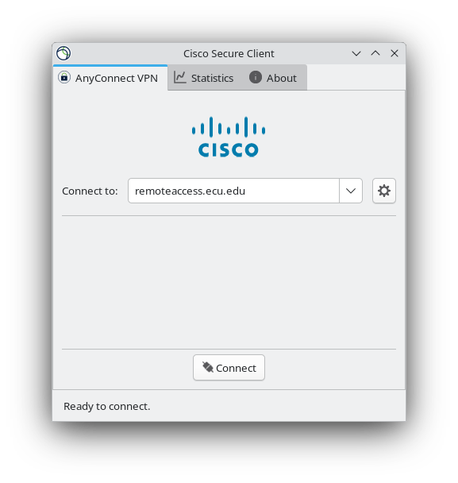
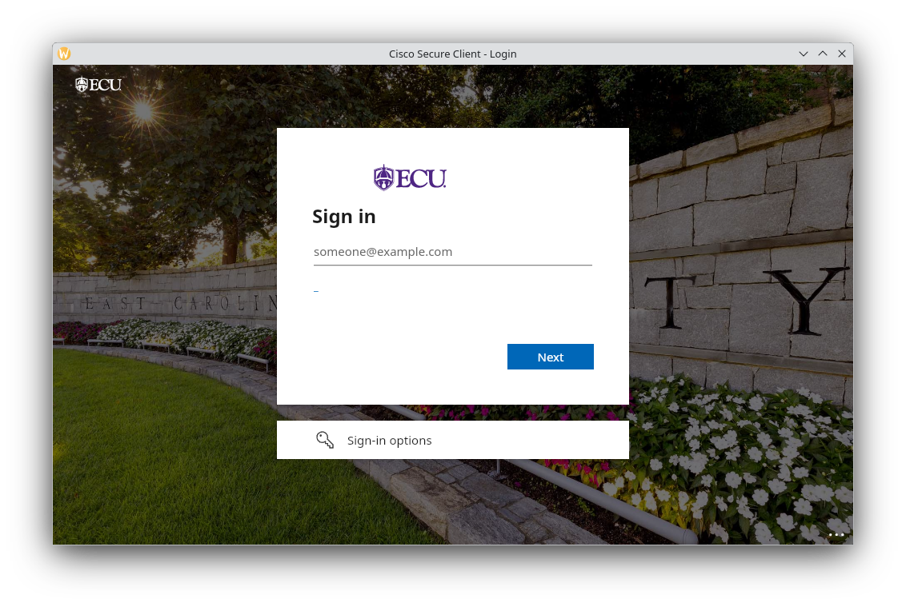
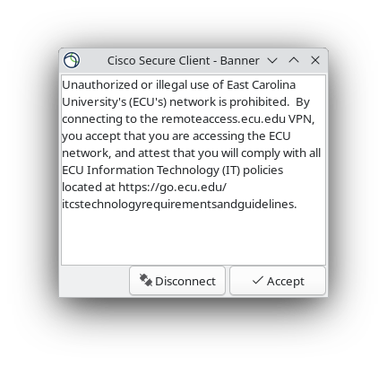
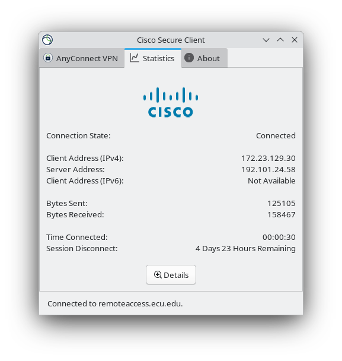

After installation, launch **Cisco Secure Client** from your applications menu:


**Cisco Secure Client can also be launched from terminal:**
```console
$ cisco-secure-client 
```
> **Note:** Launching the GUI from terminal under KDE/Wayland
> (and often with NVIDIA) will produce `GTK-CRITICAL` runtime warnings
> as the app is running parts of GTK before a widget exists (_you can ignore them_).


**Enter the ECU VPN gateway:**  


**Sign in with your ECU credentials:**  


**Accept the policy banner:**  


**After clicking `✓ Accept`, the statistics tab will open:**  
